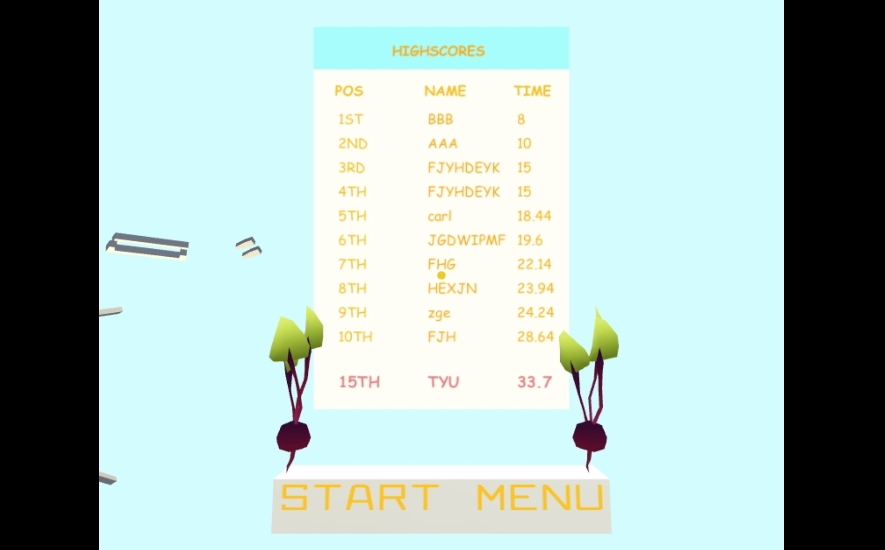

Hide And Go Beetroot
====================

*Co-authored by: Carlton Anand, Vlad Chiriac, Nicholas Barnes, and Magnus Arbuthnott*

*Click this for notes from our daily stand ups and retrospectives ==>* ***[Wiki](https://github.com/Carlton7/vr-hide-and-go-leek/wiki)***

## INTRODUCTION

Introducing Hide And Go Beetroot, a virtual reality game where you'll have to navigate the maze and find the leek before the time runs out.

This game was created as the final project of the Makers Academy software engineering bootcamp. The game flow will take the player from a start menu scene, to the game, a scene where the player enters their name, leaderboard with a button to take the player back to the start menu. Through the use of a maze creation algorithm every maze that the player attempts will be entirely unique.

## SCREENSHOTS
* Game inspired from:





## GETTING STARTED

We have a premade file for use with Samsung phones and Gear VR headsets. In order to get this working follow these steps:

- Get the complete project by running `git clone git@github.com:Carlton7/vr-hide-and-go-leek.git` in your terminal.
- Connect your Samsung to your computer.
- In the project repository find the file `vr-hide-and-go-leek/game_version01.apk` and drag into your mobile phone file structure.
- On your phone access the file and download.
- Now all you will have to do is open the vr-hide-and-go-leek file on your phone, attach it to the headset and you'll be able to enter the virtual world.

## HOW TO USE THE GAME

1. Enter the VR world and you'll see the startmenu. Use the touch pad on the side of the VR headset to tap and select the game object called `PLAY` and then choose the difficulty.
2. In the game scene you'll be able to move by pressing and holding the touchpad. If you find the leek in time you'll be directed to a scene to enter your details. If you run out of time you'll jump straight to the leaderboard scene.
3. If you find the leek in time you'll be asked to enter your details. Enter your name using the floating keyboard and the reticle in the centre of the view.
4. On the leaderboard scene you'll see a list of the top ten times, and if you were successful your own time and position at the bottom of the screen. Once you have finished looking at the leaderboard you can click the `START MENU` object at the bottom of the screen.

## USER STORIES

REQUIRED
```
As a game player,
So that I can enter the maze and start a game,
I would like to be positioned at the maze entrance.

As a game player,
So that I can search for the leek,
I would like to be able to move in different directions.

As a game player,
So that I can complete a game,
I would like to be able to see and interact with a leek.

As a game player,
So that I can see how well I've done,
I would like to be able to see my time on the screen.

As a game player,
So that I can lose a game,
I would like to be able to have a timer that ends the game if I can't find the leek.
```

NICE TO HAVE
```
As a game player,
So that I can play again,
I would like to be able to see and interact with an option to restart the game.

As a game player,
So that I can have a competitve game,
I would like to see a leaderboard with players scores.

As a game player,
So that I can have a nice experience,
I would like to hear some moody music while I play the game.
```

## TECH/FRAMEWORK USED

**Primary programming language:** *C#* is an elegant and type-safe object-oriented language that enables developers to build a variety of secure and robust applications that run on the .NET Framework.

**Testing framework:** *nunit* is an open-source unit testing framework for Microsoft .NET.

**Game engine:** *Unity Game Engine Version 2018.3.14f1*. Unity is the ultimate game development platform. It is used to build high-quality 3D and 2D games, deployable across mobile, desktop, VR/AR, console.

**VR libraries:** *Google VR* provides an SDK (Software Development Kit) which uses APIs to help with the creation of key VR features like user input, controller support, and rendering.

**Game deployment:** *Oculus* which is a digital entertainment company. It was used to power our virtual reality gameplay.
